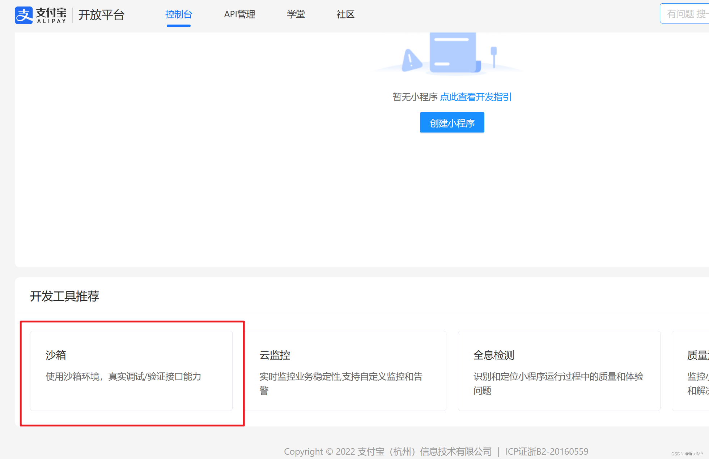

## 使用Springboot集成支付宝沙箱支付
参考：https://blog.csdn.net/XikYu/article/details/130273107?ops_request_misc=%257B%2522request%255Fid%2522%253A%2522170969519316800185857718%2522%252C%2522scm%2522%253A%252220140713.130102334..%2522%257D&request_id=170969519316800185857718&biz_id=0&utm_medium=distribute.pc_search_result.none-task-blog-2~all~top_click~default-2-130273107-null-null.142^v99^pc_search_result_base8&utm_term=%E6%94%AF%E4%BB%98%E5%AE%9D%E6%B2%99%E7%AE%B1&spm=1018.2226.3001.4187

### 1 进入支付宝开放平台
https://openhome.alipay.com
调试过程中，可采用支付宝提供的沙箱环境，点击右上角控制台，登录后选择沙箱，记下公钥、私钥、appid、支付宝网关地址

### 配置内网穿透账号
1. 注册https://natapp.cn
2. 创建免费隧道
3. 下载natapp
4. chmod a+x natapp
5. 本地运行 ./natapp -authtoken=9ab6b9040a624f40
